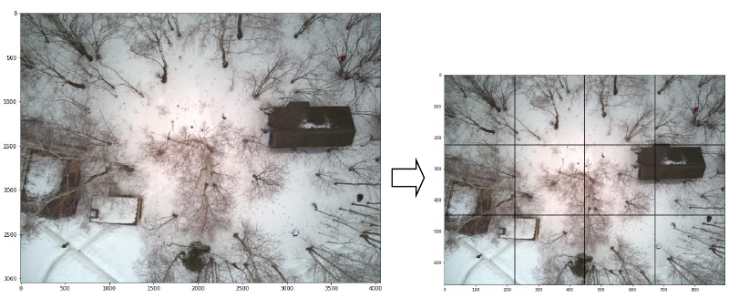

# LACMUS TFLITE OBJECT DETECTION

## Image preprocessing pipeline

Vision_API_data_prepare.ipynb  

1. Select CROP_SIZE prior to the model input (512 for EfficientDetLiteB3).
2. Select the number of windows on each axis W, H (default 3x4). 
3. The original images are compressed to a (H*CROP_SIZE, W*CROP_SIZE) (1536x2048).
4. Crop images and save it to the TESTcrops, TRAINcrops dirs. 
5. Normalized boxes annotation saved at vision.csv.

## Training pipeline 

object_detection.ipynb

Run the docker:  
docker run -it --gpus all -p 8888:8888 -v "$PWD":/tf model_maker:tf28

Out: int8 quantized tflite model, available only EfficientDetLite models.

### LADDv4winter COCO metrics

EfficientDetLiteB0 tflite (320x320) 3x4 crops

{'AP': 0.52779233,
 'AP50': 0.9402996,
 'AP75': 0.5447395,
 'APs': 0.52785134,
 'APm': -1.0,
 'APl': -1.0,
 'ARmax1': 0.36976743,
 'ARmax10': 0.60465115,
 'ARmax100': 0.6124031,
 'ARs': 0.6124031,
 'ARm': -1.0,
 'ARl': -1.0,
 'AP_/Pedestrian': 0.52779233}

EfficientDetLiteB3 tflite (512x512) 3x4 crops

{'AP': 0.6984667,
 'AP50': 0.98292786,
 'AP75': 0.8164393,
 'APs': 0.646872,
 'APm': 0.7332792,
 'APl': -1.0,
 'ARmax1': 0.4775194,
 'ARmax10': 0.748062,
 'ARmax100': 0.748062,
 'ARs': 0.70714283,
 'ARm': 0.779452,
 'ARl': -1.0,
 'AP_/Pedestrian': 0.6984667}
